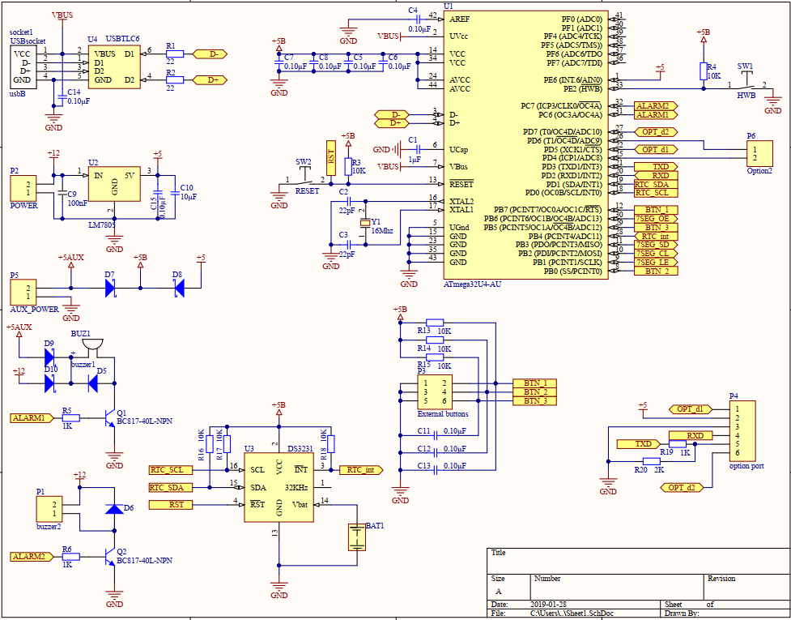
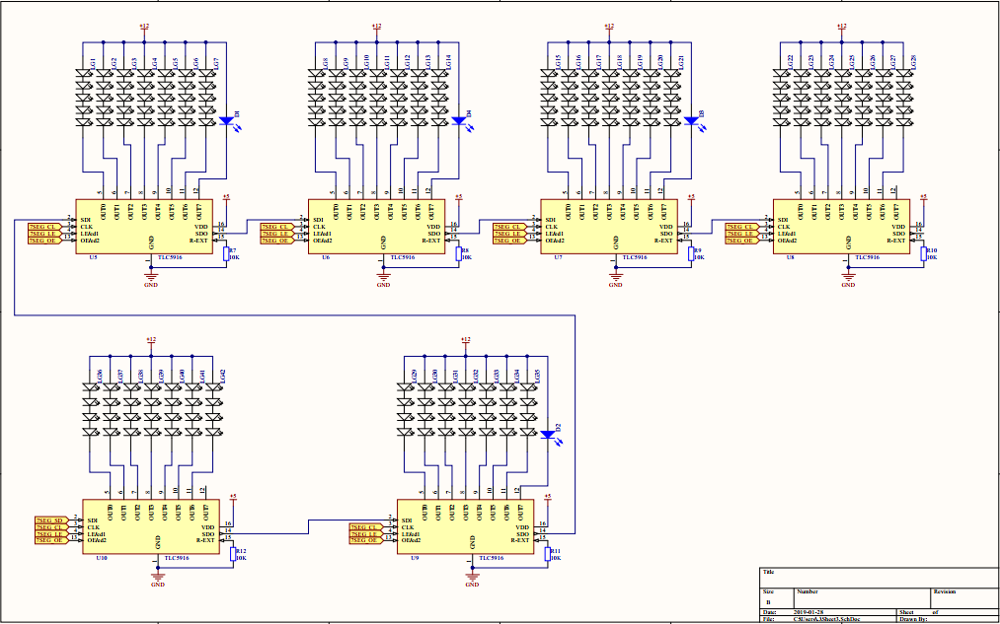
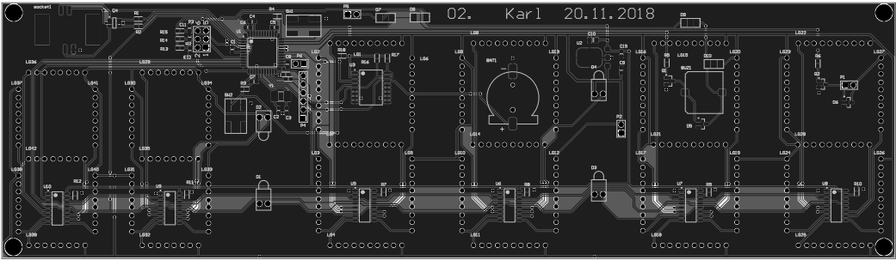
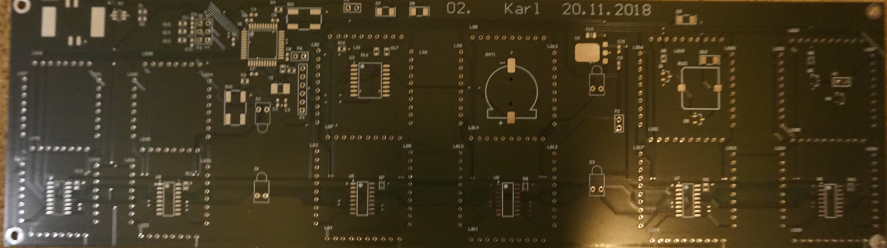
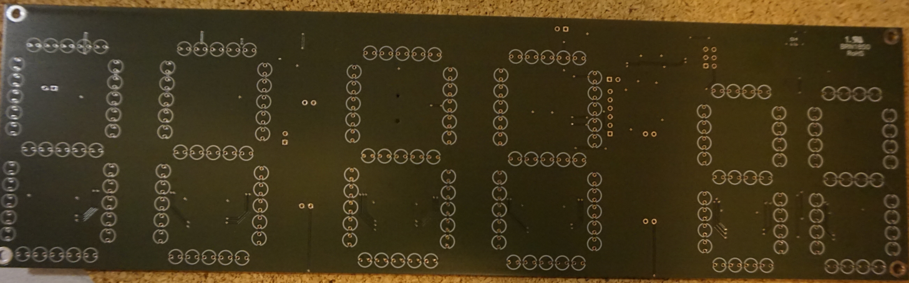
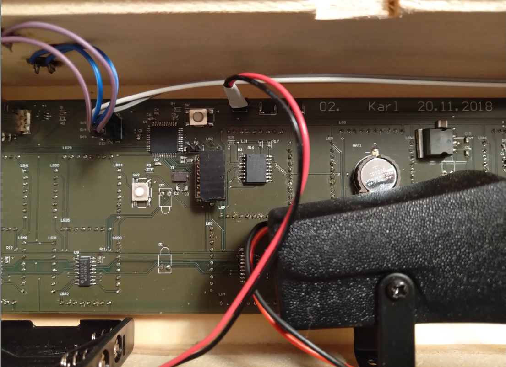
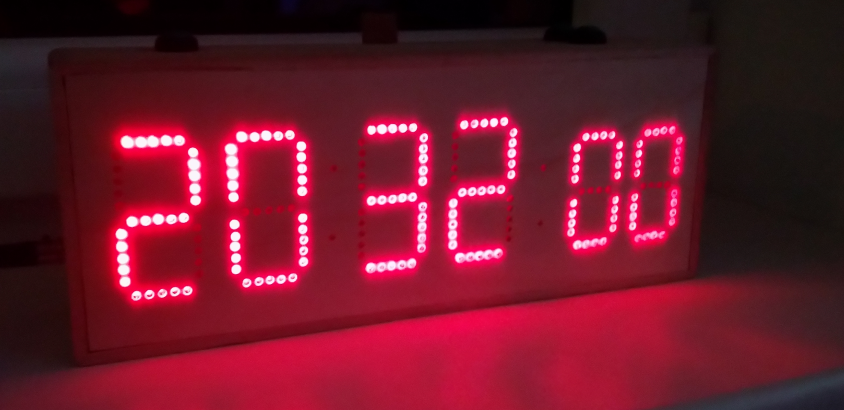

# Taust

Tegu on vanamoodse elektronkellaga, 6 numbriga ledidest 7-seg displeiga. Lisaks kellal on äratus, stopper, taimer.

Et elektrikatkestuse korral ärkamata ei jääks, toimib kell (ilma ekraanita) ka patareilt/akult.

Lisavõimalusena (option port) saab lisada bluetooth mooduli, sel juhul saab androidi apist seadistada mugavalt kellaaega.
Androidi rakendus põhineb hc05 mooduli demol.

# Skeem

Põhiskeem: 
Ekraani osa: 
Altiumi nägemus trükkplaadist: 

# Sisu:

Trükkplaat eest: 
Trükkplaat tagant: 
Valminud kella sisu: 

# tulemus:
Valminud kell: 